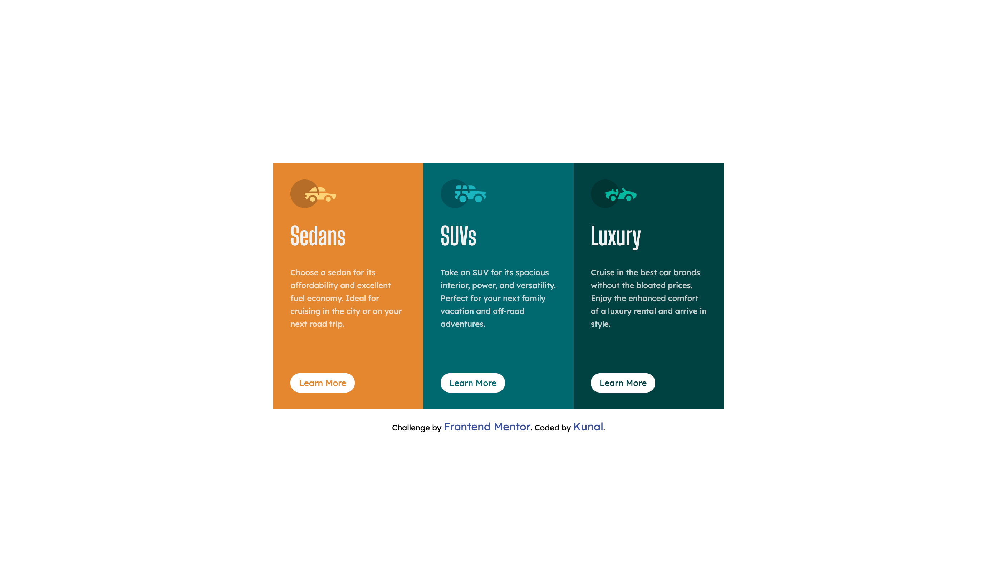
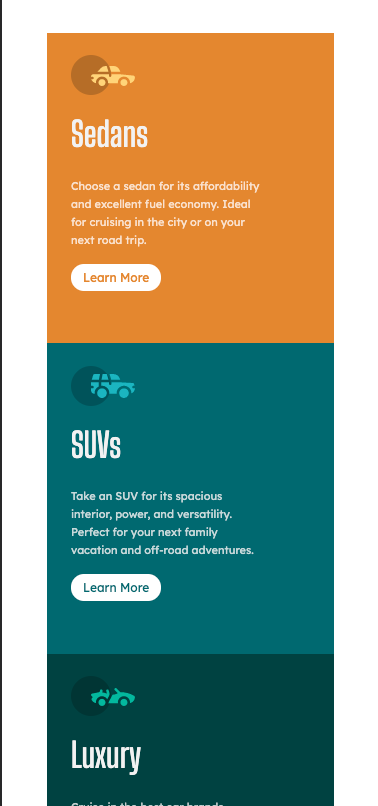

# Frontend Mentor - 3-column preview card component solution

This is a solution to the [3-column preview card component challenge on Frontend Mentor](https://www.frontendmentor.io/challenges/3column-preview-card-component-pH92eAR2-).

## Table of contents

- [Overview](#overview)
  - [The challenge](#the-challenge)
  - [Screenshot](#screenshot)
  - [Links](#links)
- [My process](#my-process)
  - [Built with](#built-with)
  - [What I learned](#what-i-learned)
  - [Useful resources](#useful-resources)
- [Author](#author)

## Overview

### The challenge

Users should be able to:

- View the optimal layout depending on their device's screen size
- See hover states for interactive elements

### Screenshot




### Links

- Solution URL: [FrontendMentor](https://www.frontendmentor.io/solutions/3-column-preview-card-component-WHmjo2vaL)
- Live Site URL: (https://3cardview.netlify.app/)

## My process

### Built with

- HTML5 markup
- CSS custom properties
- Flexbox
- CSS Grid

### What I learned

I learn how to position divs using grid.

```css
.container {
  box-sizing: border-box;
  margin: 13rem;
  display: grid;
  grid-template-columns: repeat(3, 210px);
  margin: 0 auto;
}
```

### Useful resources

- [Intro to css grid](https://css-tricks.com/snippets/css/complete-guide-grid/) - This helped me as this article is short with good explaination.

## Author

- Frontend Mentor - [@kunals741](https://www.frontendmentor.io/profile/kunals741)
- Twitter - [@KunalSatpute\_](https://twitter.com/KunalSatpute_)
