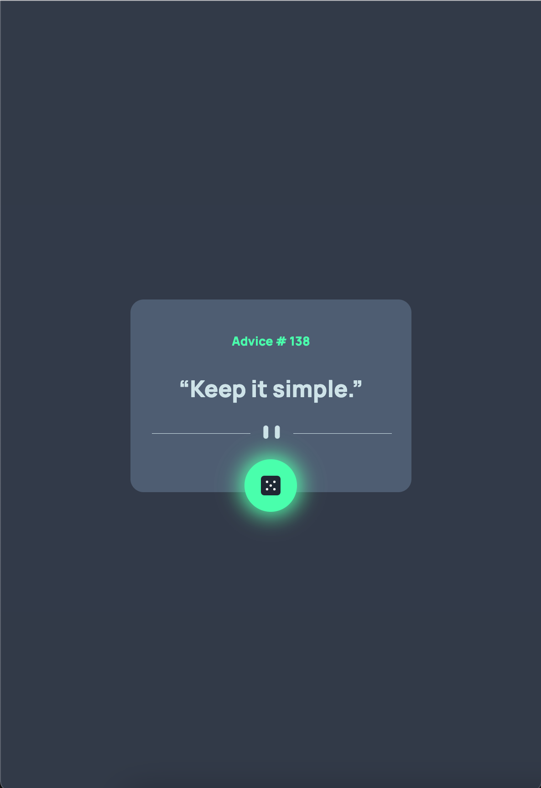
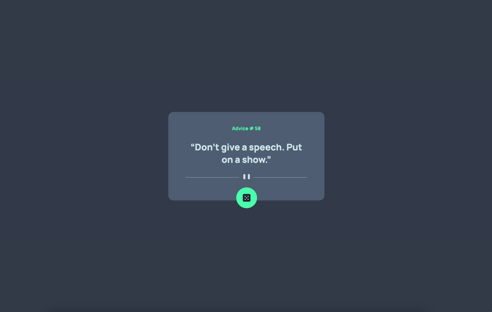

# Frontend Mentor - Tip calculator app solution

This is a solution to the [Advice generator app challenge on Frontend Mentor](https://www.frontendmentor.io/challenges/advice-generator-app-QdUG-13db). Frontend Mentor challenges help you improve your coding skills by building realistic projects.

## Table of contents

- [Overview](#overview)
  - [The challenge](#the-challenge)
  - [Screenshot](#screenshot)
  - [Links](#links)
- [My process](#my-process)
  - [Built with](#built-with)
- [Author](#author)

## Overview

### The challenge

Users should be able to:

-View the optimal layout for the app depending on their device's screen size
-See hover states for all interactive elements on the page
-Generate a new piece of advice by clicking the dice icon

### Screenshot

### Active State in Mobile View

### Desktop View

### Links

- Solution URL: [FrontendMentor Solution](https://www.frontendmentor.io/solutions/advice-generator-with-skeleton-loading-animation-adviceslip-api-SRayqKIwv)
- Live Site URL: [freeadviceforyou.netlify.com](https://freeadviceforyou.netlify.app/)

## My process

### Built with

- Semantic HTML5 markup
- CSS custom properties
- CSS Flexbox
- Javascript
- Mobile-first workflow
- CSS animations

## Author

- Frontend Mentor - [@kunals741](https://www.frontendmentor.io/profile/kunals741)
- Twitter - [@KunalSatpute\_](https://twitter.com/KunalSatpute_)
