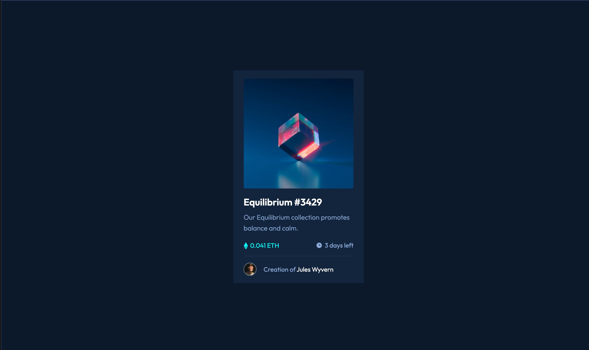

# Frontend Mentor - NFT preview card component solution

This is a solution to the [NFT preview card component challenge on Frontend Mentor](https://www.frontendmentor.io/challenges/nft-preview-card-component-SbdUL_w0U). Frontend Mentor challenges help you improve your coding skills by building realistic projects.

## Table of contents

- [Overview](#overview)
  - [The challenge](#the-challenge)
  - [Screenshot](#screenshot)
  - [Links](#links)
- [My process](#my-process)
  - [Built with](#built-with)
  - [What I learned](#what-i-learned)
  - [Useful resources](#useful-resources)
- [Author](#author)

## Overview

### The challenge

Users should be able to:

- View the optimal layout depending on their device's screen size
- See hover states for interactive elements

### Screenshot

### Links

- Solution URL: [Frontendmentor Solution](https://www.frontendmentor.io/solutions/nft-component-flip-card-YZ3V8VKKH)
- Live Site URL: [NFT-component](https://myfakenft.netlify.app/)

## My process

### Built with

- Semantic HTML5 markup
- CSS custom properties
- Flexbox
- CSS Grid
- Mobile-first workflow

### What I learned

I learnt how to flip card by using css animations.

### Useful resources

- [ Youtube - Kevil Powell ](https://youtu.be/FeJEEE3zc4U) - This video is everything, I need to learn about flipping css animation.

## Author

- Frontend Mentor - [@kunals741](https://www.frontendmentor.io/profile/kunals741)
- Twitter - [@KunalSatpute\_](https://twitter.com/KunalSatpute_)
