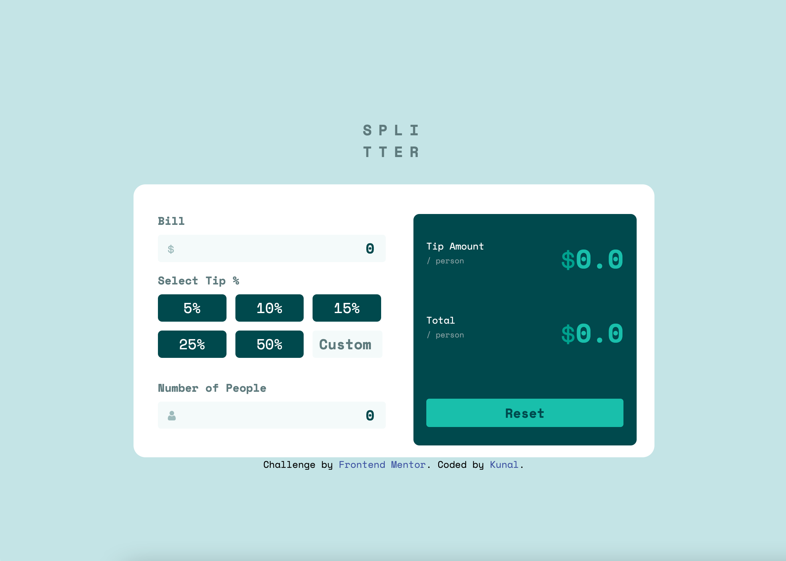
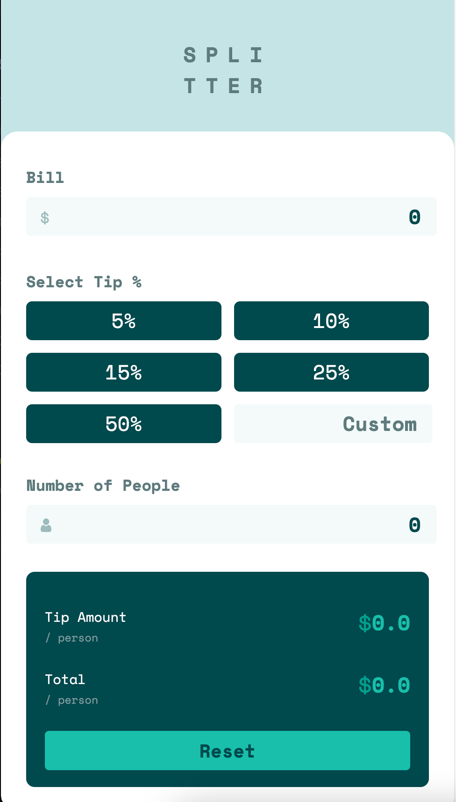

# Frontend Mentor - Tip calculator app solution

This is a solution to the [Tip calculator app challenge on Frontend Mentor](https://www.frontendmentor.io/challenges/tip-calculator-app-ugJNGbJUX). Frontend Mentor challenges help you improve your coding skills by building realistic projects.

## Table of contents

- [Overview](#overview)
  - [The challenge](#the-challenge)
  - [Screenshot](#screenshot)
  - [Links](#links)
- [My process](#my-process)
  - [Built with](#built-with)
- [Author](#author)

## Overview

### The challenge

Users should be able to:

- View the optimal layout for the app depending on their device's screen size
- See hover states for all interactive elements on the page
- Calculate the correct tip and total cost of the bill per person

### Screenshot

#### Desktop View

#### Mobile View

### Links

- Solution URL: [FrontendMentor](https://www.frontendmentor.io/solutions/tip-calculator-app-mobile-first-workflow-u_2uiEwmA)
- Live Site URL: [mytip-calculator](https://mytip-calculator.netlify.app/)

## My process

### Built with

- Semantic HTML5 markup
- CSS custom properties
- Flexbox
- CSS Grid
- CSS Flexbox
- Javascript
- Mobile-first workflow

## Author

## Author

- Frontend Mentor - [@kunals741](https://www.frontendmentor.io/profile/kunals741)
- Twitter - [@KunalSatpute\_](https://twitter.com/KunalSatpute_)
